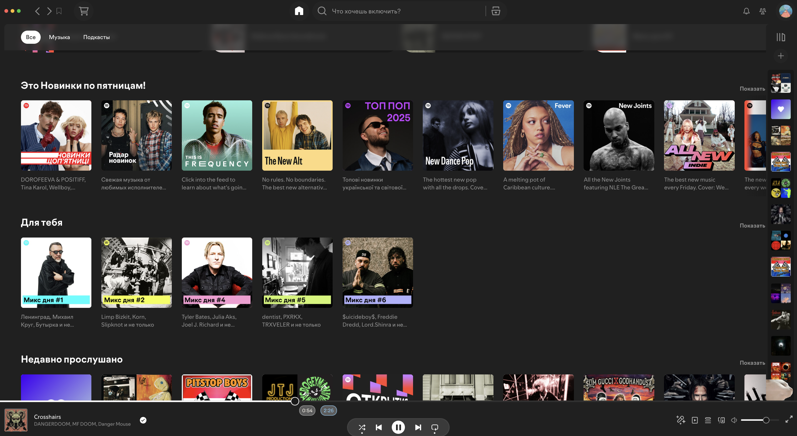
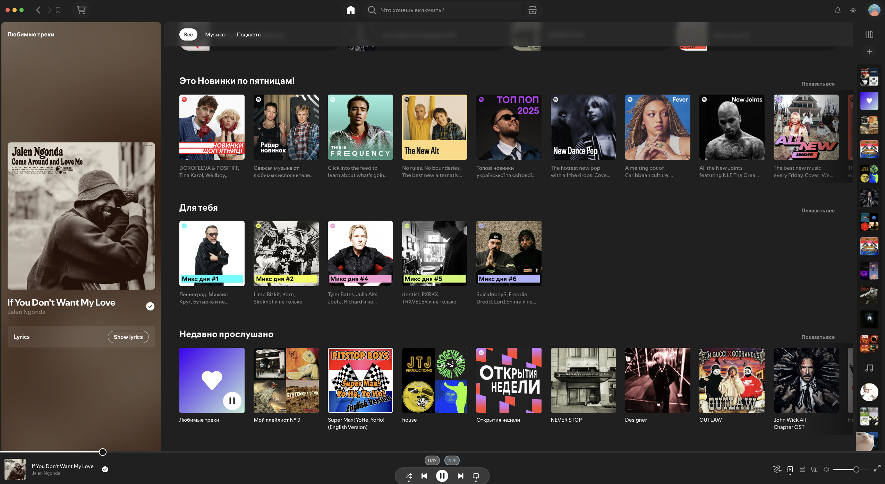
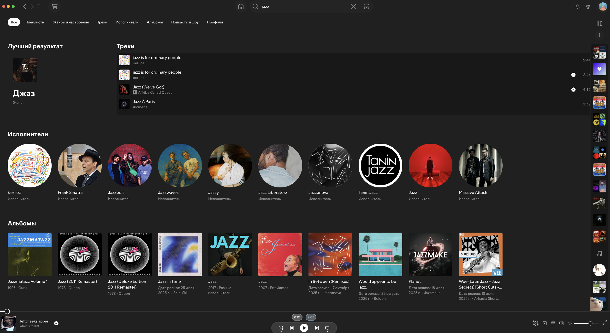

# grey-night **spicetify theme**

# Spicetify theme screenshots (grey-night)

## Menu

## Opened playlist 

## Searching menu

# How to download theme

### First open C:\Users\USERNAME\.spicetify\Themes **OR** ~/.config/spicetify/Themes and create folder grey_night and 
### 
#### **Put in** `color.ini` **and** `user.css`
### after that open C:\Users\USERNAME\.spicetify\Themes **OR** ~/.config/spicetify/**config-xpui.ini** and change 
### `current_theme = grey_night` 
### **Write** `spicetify apply` in terminal

#### thats all tysm for download my first theme

# download spicetify

## **Windows**

**Powershell (pre-built binary) - Recommended**

**Put in terminal**

`iwr -useb https://raw.githubusercontent.com/spicetify/cli/main/install.ps1 | iex`

## **Linux and MacOS**
**Shell (pre-built binary) - Recommended**

**Put in terminal**

`curl -fsSL https://raw.githubusercontent.com/spicetify/cli/main/install.sh | sh`

